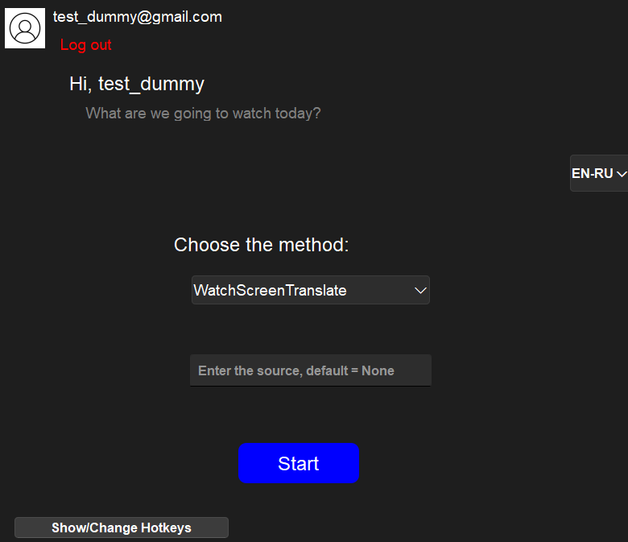
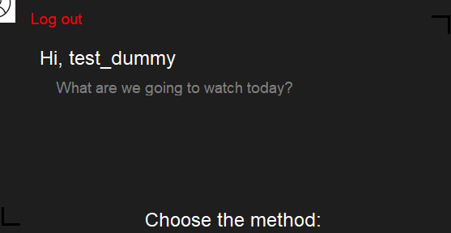
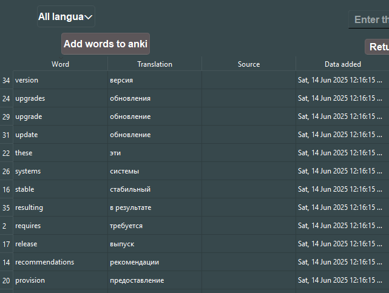

# Overview

API for WatchTrans application.  Application is created for capturing the words from the specified area on the screen, translating new words(not been in database before for the user) into desired language. Translations with the original words are stored in database and can be exported into Anki Cards.

The motivation behind the application comes from inconveniences related to learning a foreign language while whatching film or playing the game: one has to manually translate and keep record of every new word in his vocabulary.

The application was designed for multiple users with remote centralized database. This means it won't work on its own.In order to run it, the API must be set and proper domain used in configuration.

API is written using Flask, PostgreSQL is used as main database

Screenshots of User Interface created with PyQT

